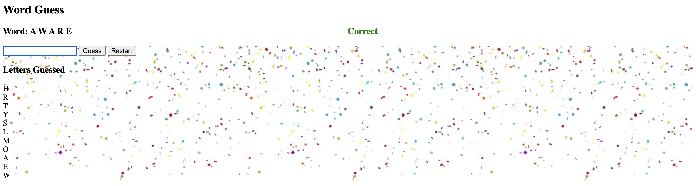

## Project 5 Files:

- confettiGIF.gif: A gif to display ona successful hangman.
- Lab-08.html: Coffee related webpage with buttons to be manipulated by Lab-08.js.
- Lab-08.js: Adds/removes DOM elements through events (buttons) and updates the list of favorite coffee drinks.
- Lab-09.html: A phonetic verbalizer with NATO phrases. 
- Lab-09.js: Takes apart the inputted word from the html and relpaces each letter with the matching NATO phonetic.
- NATO_Phonetics.png: An image to display in the Lab-09.html with the NATO phonetics list.
- p5-words.js: Random list of 50 words for hangman.
- p5.html: The hangman webpage that has guessing buttons and updates the guessed letters.
- p5.js: Handles several buttons to start/restart and guess letters in a hangman game. It will also update the correct guesses and the incorrect list in the html.

#### Sample:
  
